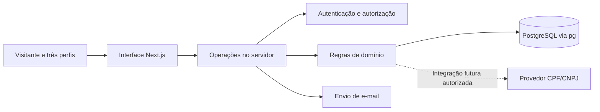
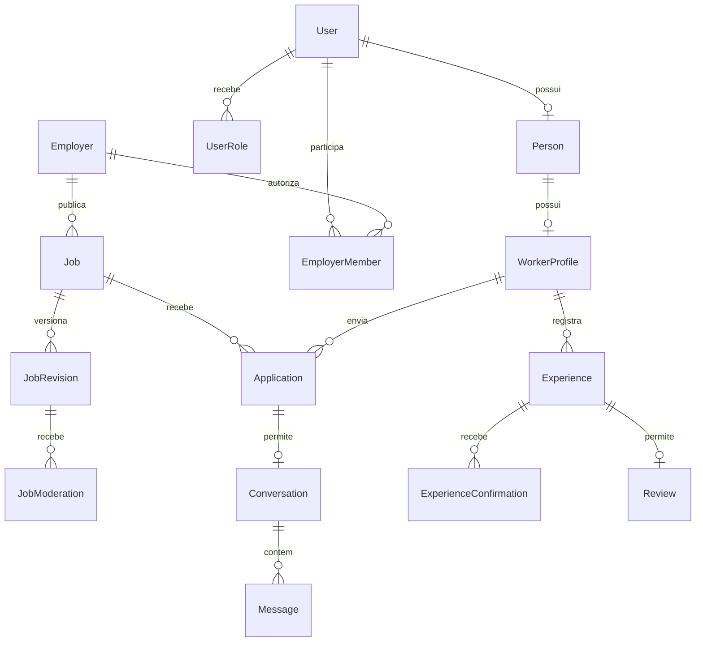

# Conecta SINTEDORP — Etapa 2: arquitetura e fluxos

Status: especificação técnica concluída. Etapa autorizada pelo usuário com “continue”. A Etapa 3 também foi autorizada e concluída; resultados em `/workspace/SintedoRP/docs/ETAPA-03-RESULTADOS.md`. A continuidade funcional foi autorizada sem novas pausas; ver `docs/ETAPAS-04-A-07-RESULTADOS.md` no checkout.

## 1. Decisões de arquitetura

Construir uma aplicação única com Next.js App Router, React e TypeScript. O servidor da aplicação será responsável por autenticação, autorização, validação e persistência. PostgreSQL armazenará os dados relacionais; O adaptador PostgreSQL oficial do Better Auth e consultas parametrizadas com pg fazem acesso ao banco; migrações SQL versionadas cuidam do esquema; Better Auth será a opção inicial para sessões e autenticação por e-mail/senha.

Essa estrutura atende páginas públicas, formulários e painéis privados sem exigir backend separado. Os módulos de domínio terão operações explícitas, como enviar vaga para análise, aprovar versão da vaga e registrar candidatura. Não será necessário criar um endpoint genérico para cada tabela.

CSS Modules e variáveis CSS serão a base visual: tipografia, cores, espaçamentos, foco e estados reutilizáveis. Bibliotecas adicionais dependerão de necessidade demonstrada. Vitest é a opção para regras isoladas e Playwright para os fluxos no navegador; versões serão escolhidas durante a instalação, verificando compatibilidade efetiva.



O banco não será acessado diretamente pelo navegador. A consulta externa de documentos não será dependência do protótipo nem apresentada como funcional antes de integração real.

### Versões candidatas e evidência

| Componente                      | Escolha inicial                  | Evidência disponível                                                    |
| ------------------------------- | -------------------------------- | ----------------------------------------------------------------------- |
| Node.js                         | Linha 24; ambiente atual 24.19.0 | Versão executada no ambiente                                            |
| npm                             | Ambiente atual 11.9.0            | Versão executada no ambiente                                            |
| Next.js                         | 16.4.0                           | Metadados npm: Node >=20.9.0 e suporte a React 19                       |
| React e React DOM               | 19.3.0, iguais                   | Pacotes consultados no npm; React DOM exige React ^19.3.0               |
| Prisma CLI, Client e adapter-pg | 7.10.0, iguais                   | Pacotes consultados no npm; CLI/Client aceitam Node >=24.0              |
| Better Auth                     | 1.7.7                            | Metadados npm declaram compatibilidade com Next 16, React 19 e Prisma 7 |
| PostgreSQL                      | Linha 17 como alvo inicial       | Escolha de arquitetura; servidor ainda não instalado ou testado         |

O rótulo `latest` de `prisma` retornou `8.0.0-rc.20`, enquanto `@prisma/client` retornou `7.10.0`. Não usar `latest` indiscriminadamente. Na instalação, fixar versões estáveis compatíveis e registrar lockfile; CLI e Client devem permanecer alinhados. A versão de TypeScript será fixada após confirmar o suporte do framework e das ferramentas, sem assumir que a versão mais recente é a melhor combinação.

Metadados indicam compatibilidade declarada, não provam funcionamento integrado. Build e testes verificarão a combinação nas etapas de implementação. Os sites oficiais de documentação retornaram HTTP 403 no túnel de rede; não foi possível confirmar seus guias nesta etapa. O registro npm esteve acessível. Não houve instalação de pacotes.

## 2. Estrutura prevista do projeto

```text
SintedoRP/
  src/
    app/                 rotas, layouts, páginas e entradas de operações
    components/          campos, botões, navegação, tabelas e mensagens
    modules/
      accounts/          perfis e permissões
      employers/         cadastro PF/PJ e membros autorizados
      jobs/              versões da vaga, análise e publicação
      applications/      candidaturas e andamento
      conversations/     contato privado e denúncias
      experiences/       histórico e confirmações
      reviews/           avaliações e contestação
      reports/           consultas gerenciais e exportação
    lib/                 conexão, sessões, validação e utilitários comuns
    styles/              tokens e estilos globais
    demo/                dados e comportamentos exclusivos do protótipo
  prisma/                schema e migrações, a partir da Etapa 4
  tests/                 testes de regras, integração e navegador
  docs/                  instruções e decisões aprovadas para o projeto
```

Criar arquivos e módulos quando forem utilizados, sem gerar pastas vazias ou abstrações repetidas. Os documentos atuais permanecem em `/workspace/planning` até a organização do repositório na implementação.

## 3. Identidade e permissões

Uma conta poderá acumular os perfis de trabalhador e empregador, usando áreas de navegação distintas. Isso evita duplicar a identidade de quem trabalha e também contrata. Cada operação valida as permissões da conta e o recurso acessado; selecionar um painel na interface não concede privilégios.

O sindicato é uma instituição administradora única neste MVP. Seus usuários recebem funções de administração, moderação ou análise de relatórios por convite/provisionamento autorizado. O primeiro administrador será criado por procedimento controlado no servidor, sem senha padrão ou endpoint público de promoção.

| Operação                       | Visitante | Trabalhador              | Empregador                                    | Sindicato                                               |
| ------------------------------ | --------- | ------------------------ | --------------------------------------------- | ------------------------------------------------------- |
| Ver vagas publicadas           | Sim       | Sim                      | Sim                                           | Sim                                                     |
| Editar perfil profissional     | Não       | Próprio                  | Só se também trabalhador                      | Não por padrão                                          |
| Criar/editar vaga              | Não       | Não                      | Empregadores de que é membro                  | Solicitar ajuste; não reescrever silenciosamente        |
| Publicar/suspender vaga        | Não       | Não                      | Não                                           | Moderador autorizado                                    |
| Candidatar-se                  | Não       | Própria conta            | Só se também trabalhador                      | Não em nome de terceiros por padrão                     |
| Consultar candidatura          | Não       | A própria                | Ligada à própria vaga                         | Equipe autorizada para atendimento/moderação            |
| Ler conversa                   | Não       | Se participante          | Se participante                               | Apenas atendimento autorizado de denúncia, com registro |
| Consultar histórico individual | Não       | Próprio                  | Trechos compartilhados na candidatura         | Quando necessário à função autorizada                   |
| Registrar avaliação            | Não       | Vínculo elegível próprio | Não                                           | Não em nome do trabalhador                              |
| Consultar avaliação restrita   | Não       | A própria                | Conteúdo autorizado para resposta/contestação | Moderador autorizado                                    |
| Exportar relatório gerencial   | Não       | Não                      | Não no MVP                                    | Analista/administrador autorizado                       |
| Conceder função sindical       | Não       | Não                      | Não                                           | Administrador autorizado                                |

Toda operação privada será validada no servidor. Uma conta sindical que também seja membro de um empregador não poderá aprovar sua própria vaga; a decisão deverá ser de outro moderador. Alterações de função e suspensão de conta devem produzir efeito em sessões ativas.

Autenticação proposta: e-mail/senha, confirmação de e-mail, recuperação por token de uso único e expiração, cookies de sessão seguros e proteção contra abuso. Não usar CPF, CNPJ ou data de nascimento como senha. E-mail real precisa de provedor configurado; testes podem usar uma caixa local de desenvolvimento, sem declarar entrega externa.

## 4. Modelo de dados lógico

Identificadores serão UUID; instantes serão armazenados em UTC e exibidos no fuso America/Sao_Paulo. Valores monetários usarão centavos inteiros e moeda BRL; remuneração sempre terá periodicidade explícita. Campos de data sem horário, como início de experiência, usarão tipo date.

| Entidade                             | Campos/relações principais                                                                        | Restrições                                                                                                   |
| ------------------------------------ | ------------------------------------------------------------------------------------------------- | ------------------------------------------------------------------------------------------------------------ |
| User, Session, Account, Verification | Tabelas de autenticação mantidas pela biblioteca; e-mail e situação da conta                      | Schema gerado conforme a versão instalada; tokens e hashes não entram nas respostas da aplicação             |
| UserRole                             | user_id, papel, responsável pela concessão                                                        | Par usuário/papel único; papel sindical não aceito no cadastro público                                       |
| Person                               | user_id, nome, nome de exibição, CPF normalizado, situação de verificação                         | Um perfil pessoal por conta; CPF único quando informado; documento não público                               |
| WorkerProfile                        | person_id, apresentação, região, disponibilidade                                                  | Um perfil por pessoa; funções profissionais em relação própria                                               |
| Employer                             | tipo PF/PJ, person_id ou CNPJ, nome de exibição, situação cadastral                               | PF referencia pessoa e não usa CNPJ; PJ exige CNPJ e não usa person_id como identidade; CNPJ único           |
| EmployerMember                       | employer_id, user_id, função                                                                      | Par único; criar associação exige autorização, não basta informar um ID/CNPJ                                 |
| Job                                  | employer_id, estado, versão publicada, versão em análise, version para concorrência               | Pertence a um empregador; referências de versões devem pertencer à mesma vaga                                |
| JobRevision                          | job_id, número, função, descrição, cidade/região, remuneração, periodicidade, jornada, benefícios | Par vaga/número único; versão enviada para análise é imutável                                                |
| JobModeration                        | revisão, decisão, motivo, moderator_id, instante                                                  | A decisão identifica exatamente a revisão analisada                                                          |
| TermsVersion e TermsAcceptance       | versão, conteúdo/hash, finalidade; ator e revisão da vaga quando aplicável                        | Aceite vinculado a versão e finalidade; alteração de termos não reescreve aceites antigos                    |
| Application                          | job_id, worker_id, job_revision_id, estado, instantes, version                                    | Par vaga/trabalhador único; registra a versão vista na candidatura                                           |
| ApplicationEvent                     | candidatura, estado anterior/novo, ator e instante                                                | Histórico de transições; sem sobrescrever eventos antigos                                                    |
| Conversation e Message               | application_id; remetente, conteúdo, instante, estado de leitura                                  | Uma conversa por candidatura; acesso deriva dos participantes e permissões atuais                            |
| Experience                           | worker_id, employer_id opcional, application_id opcional, datas, função, origem e situação        | Experiência externa pode ser autodeclarada; vínculo associado exige coerência entre trabalhador e empregador |
| ExperienceConfirmation               | experience_id, ator, papel, resposta e instante                                                   | Confirmações distintas por parte; conflito não vira confirmação automática                                   |
| Review                               | experience_id, autor, nota, texto, situação                                                       | Uma avaliação por experiência; nota entre 1 e 5; autor deve ser o trabalhador da experiência                 |
| Case                                 | alvo (vaga/mensagem/avaliação), denunciante, motivo, situação, responsável                        | Referência válida a exatamente um alvo; acesso restrito por função                                           |
| ReviewResponse                       | review_id, autor autorizado, resposta, instante                                                   | Autor deve representar o empregador envolvido; não revela documentos do trabalhador                          |
| AuditEvent                           | ator, ação, tipo/id do recurso, instante e metadados mínimos                                      | Sem senha, token, documento integral ou conteúdo de conversa no log                                          |

Normalizar CPF/CNPJ conforme formato suportado e validar regras atuais antes da implementação. O modelo de CNPJ deve aceitar identificadores alfanuméricos aplicáveis, sem conversão para número. Não duplicar CPF bruto em diversas tabelas. Consultas retornam apenas os campos necessários ao destinatário. Proteção de banco/backups e retenção serão requisitos da hospedagem.



O diagrama destaca relações centrais; a tabela é a referência completa. Índices iniciais: vaga por estado/cidade/função/data de publicação, candidatura por trabalhador e por vaga, mensagem por conversa/data, experiência por trabalhador e eventos administrativos por recurso/data. Unicidade e chaves estrangeiras serão garantidas pelo banco; autorização continua responsabilidade do servidor.

## 5. Estados e concorrência

### Vagas e revisões

| Ação                   | Origem → destino                                                   | Quem e condições                                                              |
| ---------------------- | ------------------------------------------------------------------ | ----------------------------------------------------------------------------- |
| Salvar rascunho        | Rascunho → rascunho                                                | Membro do empregador; campos podem estar incompletos                          |
| Enviar para análise    | Rascunho/ajustes solicitados → pendente                            | Campos válidos e aceite das regras; cria revisão imutável                     |
| Pedir ajuste           | Pendente → ajustes solicitados                                     | Moderador, com motivo                                                         |
| Rejeitar               | Pendente → rejeitada                                               | Moderador, com motivo; correção cria nova revisão para análise                |
| Aprovar                | Pendente → publicada                                               | Moderador sem conflito de interesse; revisão ainda atual                      |
| Alterar vaga publicada | Publicada → pendente                                               | Empregador confirma retirada temporária da busca; nova revisão e nova análise |
| Suspender              | Publicada → suspensa                                               | Moderador com motivo; bloqueia novas candidaturas                             |
| Reanalisar suspensão   | Suspensa → pendente                                                | Moderador libera reenvio/correção; nova aprovação obrigatória                 |
| Encerrar               | Rascunho/pendente/ajustes/rejeitada/publicada/suspensa → encerrada | Empregador responsável ou moderador; motivo registrado                        |

Encerrada é terminal no MVP. Para outra oportunidade, duplicar os dados em novo rascunho. Candidaturas existentes preservam a versão original e avisam quando a vaga sai de publicação. Elas não são apagadas por edição ou suspensão.

A aprovação verifica o ID da revisão e a versão de concorrência; duas decisões simultâneas não podem aprovar conteúdo diferente. Atualização de estado, decisão e auditoria devem ocorrer na mesma transação.

### Candidaturas

Estados: enviada, em análise, contato iniciado, proposta enviada, contratação informada, não selecionada e desistiu.

- Trabalhador cria a própria candidatura e pode desistir antes de contratação informada.
- Empregador pode avançar enviada → em análise → contato iniciado → proposta enviada → contratação informada; pode marcar não selecionada nas etapas anteriores à contratação.
- “Contratação informada” é a declaração do empregador, não comprovação de vínculo. A experiência é criada como pendente de confirmação do trabalhador. Discordância gera atendimento; não se apaga o histórico.
- Desistiu e não selecionada encerram aquela candidatura no MVP; nova candidatura à mesma vaga não será criada automaticamente.
- Encerrar a vaga bloqueia novos envios. Candidaturas ativas exigem resultado explícito ou encerramento com motivo; não recebem contratação automática.

Na criação, validar vaga publicada e evitar corrida com encerramento na mesma transação, usando bloqueio/controle de concorrência da vaga. Constraint única impede duplicação por clique repetido. Não permitir que alguém se candidate a vaga de empregador que representa.

### Histórico e avaliações

Experiência: autodeclarada, pendente de confirmação, confirmada pelas partes, contestada. Situação temporal (em andamento ou encerrada) é independente da verificação. Uma parte não confirma pelas duas.

Regra inicial de elegibilidade: experiência ligada a empregador cadastrado, confirmada pelas partes e encerrada. Avaliação fica restrita ao autor e à moderação; empregador recebe o conteúdo autorizado para resposta ou contestação. Essa política será validada antes de operar com dados reais. Experiência autodeclarada não habilita avaliação automaticamente.

Situações da avaliação: enviada, em análise, disponível para resposta, contestada, concluída ou removida da exibição com motivo. Não haverá nota pública agregada no MVP inicial. Uma futura política pública exigirá revisão explícita.

## 6. Contratos das operações

| Operação              | Entrada e validação                                   | Resultado                                                              |
| --------------------- | ----------------------------------------------------- | ---------------------------------------------------------------------- |
| Buscar vagas          | Filtros permitidos, página/limite, ordenação estável  | Dados públicos da revisão aprovada, sem documento ou endereço completo |
| Salvar/enviar vaga    | Dados, empregador autorizado, versão esperada, aceite | Rascunho ou revisão pendente; campos com erro identificados            |
| Moderar vaga          | Revisão, versão esperada, decisão e motivo            | Transição registrada ou conflito se o conteúdo mudou                   |
| Candidatar-se         | ID da vaga, perfil completo, sessão autorizada        | Candidatura única vinculada à versão publicada                         |
| Alterar candidatura   | ID, estado esperado e ação permitida                  | Evento e novo estado, sem alterar candidatura alheia                   |
| Enviar mensagem       | Candidatura/conversa acessível, texto limitado        | Mensagem persistida; texto renderizado sem HTML arbitrário             |
| Confirmar experiência | ID, papel da parte e confirmação/discordância         | Estado calculado pelas confirmações disponíveis                        |
| Registrar avaliação   | Experiência elegível, nota e texto                    | Avaliação restrita, com possibilidade de atendimento                   |
| Gerar relatório       | Perfil sindical autorizado, período e filtros válidos | Agregações e CSV com colunas permitidas                                |

Operações de formulário podem usar Server Actions chamando funções do domínio. Rotas HTTP serão usadas quando necessárias à autenticação, exportação e futuras integrações. Nenhuma regra de permissão ficará apenas no layout ou middleware.

Formato comum de falha para UI: código estável, mensagem útil e erros por campo, sem stack trace. Diferenciar sessão expirada, permissão insuficiente, recurso indisponível, conflito de edição e falha temporária. Evitar confirmar a existência de contas/documentos em respostas públicas.

Filtros de remuneração sempre incluem periodicidade: não comparar automaticamente valor diário a salário mensal. Busca será paginada e ordenada por publicação e ID. Relatórios e exportações terão limites para não bloquear o servidor.

## 7. Mapa de telas e navegação

| Rota proposta                                | Perfil              | Conteúdo principal                                                 | Etapa de implementação              |
| -------------------------------------------- | ------------------- | ------------------------------------------------------------------ | ----------------------------------- |
| `/`                                          | Público             | Objetivo, encontrar trabalho, publicar vaga, como funciona e ajuda | 3                                   |
| `/vagas`                                     | Público             | Busca, filtros, resultados e estados vazios                        | 3; dados reais na 4                 |
| `/vagas/[id]`                                | Público/trabalhador | Condições, situação e ação de candidatura                          | 3/4                                 |
| `/entrar`, `/cadastro`, `/recuperar-acesso`  | Público             | Acesso e cadastro trabalhador/empregador PF/PJ                     | 3/4                                 |
| `/como-funciona`, `/privacidade`, `/contato` | Público             | Orientação, conteúdo institucional e ajuda                         | 3; texto final depende de validação |
| `/trabalhador`                               | Trabalhador         | Resumo de candidaturas e próximas ações                            | 3/4                                 |
| `/trabalhador/perfil`                        | Trabalhador         | Cadastro profissional, região e disponibilidade                    | 3/4                                 |
| `/trabalhador/candidaturas`                  | Trabalhador         | Andamento e detalhe das próprias candidaturas                      | 3/4                                 |
| `/trabalhador/historico`                     | Trabalhador         | Experiências, confirmação e avaliações elegíveis                   | 3/5                                 |
| `/mensagens`, `/mensagens/[id]`              | Participantes       | Conversas autorizadas e denúncia                                   | 3/5                                 |
| `/empregador`                                | Empregador          | Resumo e pendências das próprias vagas                             | 3/4                                 |
| `/empregador/cadastro`                       | Empregador          | Tipo PF/PJ e dados cadastrais                                      | 3/4                                 |
| `/empregador/vagas/nova`                     | Empregador          | Formulário, revisão e aceite antes do envio                        | 3/4                                 |
| `/empregador/vagas/[id]`                     | Empregador          | Edição, situação, motivo de ajuste e encerramento                  | 3/4                                 |
| `/empregador/vagas/[id]/candidaturas`        | Empregador          | Candidatos da vaga e ações permitidas                              | 3/4                                 |
| `/sindicato`                                 | Sindicato           | Fila de análise e pendências                                       | 3/4                                 |
| `/sindicato/vagas/[id]`                      | Moderador           | Revisão completa e decisão fundamentada                            | 3/4                                 |
| `/sindicato/empregadores`                    | Equipe autorizada   | Consulta cadastral restrita e situação                             | 3/4                                 |
| `/sindicato/atendimentos`                    | Moderador           | Denúncias, experiências contestadas e avaliações                   | 3/5                                 |
| `/sindicato/relatorios`                      | Analista/admin      | Indicadores, filtros e exportação                                  | 3/5                                 |
| `/sindicato/equipe`                          | Admin               | Convites, papéis e revogação de acesso                             | 3/4                                 |

Na Etapa 3, as telas representarão esses fluxos com dados fictícios e ações de demonstração. Autenticação simulada deverá aparecer identificada como demonstração, sem receber credenciais ou documentos reais. A navegação de demonstração será exclusiva desse modo; não substituirá a autenticação de produção.

Navegação móvel: trabalhador com vagas, candidaturas, mensagens e perfil; empregador com vagas, candidaturas, mensagens e cadastro; sindicato com fila, atendimentos, relatórios e equipe conforme permissão. Tabelas densas terão apresentação móvel apropriada; nenhum recurso dependerá apenas de hover.

## 8. Direção visual para o protótipo

Proposta provisória: base clara, verde escuro para identidade e ações principais, tom quente moderado para destaques, tipografia de boa leitura e superfícies com contraste suficiente. Essa paleta não será apresentada como marca oficial do sindicato. O contraste será medido ao implementar.

Página inicial com duas ações explícitas: “Encontrar trabalho” e “Publicar vaga”. Explicar a mediação sindical em passos curtos. Cartões de vaga priorizam função, região, remuneração/periodicidade e jornada. Texto “Analisada pelo sindicato” descreve a revisão, sem prometer segurança jurídica absoluta.

Usar conteúdo e números fictícios apenas em contexto claramente identificado como demonstração. Não inventar logotipo oficial, parceiros, depoimentos, certificações ou quantidade real de pessoas atendidas. Formulários devem permitir revisar os dados antes de enviar, preservar valores diante de erro e fornecer feedback compreensível.

## 9. Relatórios e significados

Relatório por empregador/período: vagas enviadas, aprovadas, encerradas, candidaturas recebidas, contratações informadas, experiências confirmadas e avaliações registradas. Não chamar candidatura aceita de emprego comprovado.

Cada indicador define seu evento temporal: envios pela data de envio, aprovações pela decisão, candidaturas pela criação, contratações pelo evento e confirmações pelo instante em que ambas as partes confirmam. Filtro de situação atual será identificado separadamente de contagens por evento. Usar início inclusivo e fim exclusivo no fuso de exibição convertido para UTC.

CSV inicial: empregador (nome de exibição e ID interno), período e totais. Não exportar CPF, contatos pessoais ou conteúdo de mensagens. Neutralizar células que possam ser interpretadas como fórmulas. Médias de avaliação, se autorizadas depois, precisam informar quantidade, elegibilidade e regras de inclusão.

## 10. Plano de validação por etapa

| Verificação       | Evidência esperada                                                                                         | Etapa            |
| ----------------- | ---------------------------------------------------------------------------------------------------------- | ---------------- |
| Protótipo         | Navegação dos três perfis; filtros, formulários e estados demonstráveis; identificação dos dados fictícios | 3                |
| Responsividade    | Inspeção em 360, 390, 768 e 1280 px; teclado, foco, rótulos e ausência de cortes                           | 3 e revisão na 6 |
| Autenticação      | Sessão, saída, token expirado/usado, recuperação e revogação                                               | 4                |
| Autorização       | Requisições entre duas contas de cada papel; leitura/alteração alheia negadas no servidor                  | 4/5              |
| Vagas             | Revisão exata aprovada; alteração exige análise; conflito entre decisões tratado                           | 4                |
| Candidaturas      | Duplicidade, vaga encerrada, disputa simultânea de encerramento/envio e desistência                        | 4                |
| Contato/histórico | Conversa alheia bloqueada; origem/confirmadores preservados; contestação tratada                           | 5                |
| Avaliações        | Vínculo inelegível bloqueado, nota limitada, duplicidade impedida e visibilidade correta                   | 5                |
| Relatórios        | Totais conferidos com conjunto conhecido; limites temporais e exportação verificados                       | 5                |
| Entrega           | Instalação pelo lockfile, migração em banco vazio, build, testes críticos e instruções reproduzidas        | 6/7              |

Build do protótipo não comprova segurança ou persistência do MVP. Testes automatizados de acessibilidade não substituem inspeção manual de teclado e compreensão dos formulários.

## 11. Configuração e dependências externas

Configurações previstas: conexão PostgreSQL (`DATABASE_URL`), URL da aplicação/autenticação, segredo de sessão, provedor de e-mail e opções de demonstração somente para ambiente de desenvolvimento. Os nomes exatos exigidos pela biblioteca serão confirmados na implementação; arquivos de exemplo conterão apenas placeholders. Nenhum segredo foi solicitado ou criado nesta etapa.

Processo PostgreSQL e envio de e-mail são requisitos da Etapa 4. A ausência atual de `psql` não impede a arquitetura ou o protótipo. O executável Docker existe, mas daemon e capacidade de iniciar containers não foram testados; não assumir que um banco em Docker já esteja disponível.

Para o protótipo, serão necessárias dependências frontend e ferramentas de teste. A Etapa 3 deverá instalar e testar essas dependências, registrar configuração reutilizável de instalação/inicialização quando necessária e usar o checkout existente, sem criar worktree salvo pedido explícito.

Acesso a APIs de CPF/CNPJ, e-mail externo e hospedagem não está validado. As regras institucionais pendentes do documento da Etapa 1 permanecem pendentes; esta arquitetura estabelece pontos de integração e visibilidade, não as aprova.

## 12. Resultado e limite desta etapa

Entregues: stack justificada, estrutura do projeto, matriz de autorização, entidades e restrições, estados/transações, operações, mapa de telas, direção visual e plano de validação. Os requisitos R01–R13 da Etapa 1 permanecem contemplados.

| Requisito               | Cobertura principal nesta especificação                          |
| ----------------------- | ---------------------------------------------------------------- |
| R01 Cadastro            | Seções 3, 4 e 7: autenticação, identidade e telas de cadastro    |
| R02 CPF/CNPJ            | Seções 1, 4 e 11: identificação, validação e integração pendente |
| R03 Perfis              | Seção 3: matriz de permissões e checagens no servidor            |
| R04 Perfil profissional | Seções 4 e 7: WorkerProfile e área do trabalhador                |
| R05 Vagas               | Seções 4–6: revisões, análise, aceite e transações               |
| R06 Busca               | Seções 6 e 7: filtros, periodicidade, paginação e telas          |
| R07 Candidaturas        | Seções 4–6: unicidade, versão original e estados                 |
| R08 Contato             | Seções 3, 4, 6 e 7: participantes, mensagens e denúncias         |
| R09 Histórico           | Seções 4 e 5: origem e confirmação da experiência                |
| R10 Avaliações          | Seções 3–5: elegibilidade, visibilidade e contestação            |
| R11 Relatórios          | Seções 6, 7 e 9: indicadores, período e exportação               |
| R12 Acessibilidade      | Seções 7, 8 e 10: navegação, formulários e validação             |
| R13 Administração       | Seções 3–5 e 7: papéis sindicais, moderação e auditoria          |

Verificado no ambiente: checkout sem código/commits locais; Node e npm disponíveis; metadados dos pacotes candidatos consultados e compatibilidade declarada analisada. Não foram executados build, migrações ou testes de aplicação; não há código instalado para isso.

A Etapa 3 prevista aqui foi autorizada e concluída: telas dos três perfis, dados fictícios, interações demonstráveis, build e inspeção em celular. Resultados em `/workspace/SintedoRP/docs/ETAPA-03-RESULTADOS.md`. As Etapas 4–7 foram implementadas e verificadas no checkout; resultados na documentação atual.

## Decisão de implementação nas Etapas 4–7

Prisma foi retirado após bloqueio do download oficial do mecanismo nativo. Foram usados o adaptador PostgreSQL do Better Auth e pg, sem desativar verificação de integridade ou TLS. A estrutura implementada, resultados e diferenças em relação a esta proposta estão em `README.md`, `docs/ETAPAS-04-A-07-RESULTADOS.md` e `docs/PUBLICACAO.md`. A seção de infraestrutura acima registra a situação histórica da etapa de arquitetura; Docker, PostgreSQL e e-mail local foram posteriormente preparados e testados.
